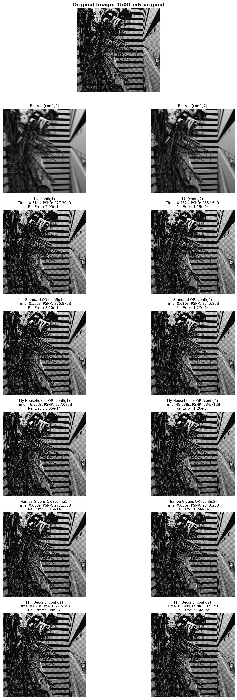
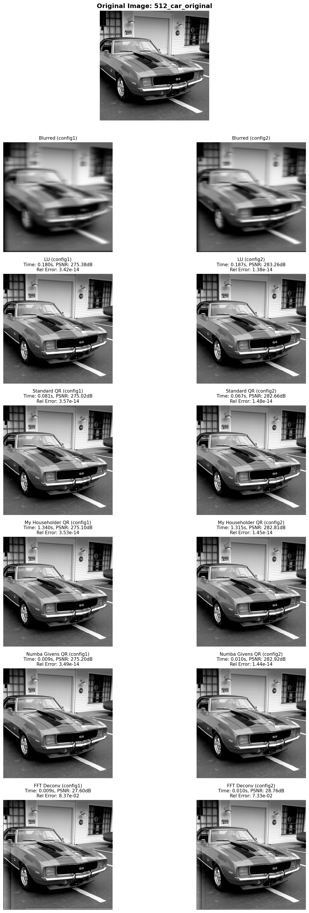

# High-Performance Numerical Image Deblurring (QR & LU Factorization)

## 1. Project Overview

### 1.1 What is the project about?
This project addresses the problem of reconstructing clear images from blurred observations. The blurring process is modeled as a linear system:

$$ A_{\ell} X A_{r} = B $$

where $X \in \mathbb{R}^{n \times n}$ is the original image, $B \in \mathbb{R}^{n \times n}$ is the blurred image, and $A_{\ell}, A_{r} \in \mathbb{R}^{n \times n}$ are structured blurring kernels. The core objective is to recover $X$ from $B$ by solving this system using numerical factorization methods, specifically focusing on QR factorization.

The project involves two main phases:
1.  **Implementation & Analysis**: Developing standard solvers (LU, QR) and implementing a custom Householder QR factorization from scratch.
2.  **Competition & Optimization**: Optimizing the algorithm for maximum efficiency and robustness to compete in a Kaggle challenge, where the goal is to minimize a combined score of reconstruction error and runtime.

---

## 2. Implementation Details

### 2.1 Algorithmic Components Implemented

I have implemented a comprehensive suite of solvers, ranging from textbook algorithms to highly optimized high-performance computing (HPC) solutions.

#### A. Standard Solvers (Baseline)
*   **LU Factorization**: Solving $A_{\ell} X A_{r} = B$ by decomposing $A_{\ell} = P_{\ell} L_{\ell} U_{\ell}$ and $A_{r}^T = P_{r} L_{r} U_{r}$ (where $P$ is a permutation matrix for partial pivoting). The solution proceeds in two steps:
    1.  Solve $A_{\ell} Y = B$: First apply permutation $P_{\ell}^T$ to $B$, then solve $L_{\ell} Z = P_{\ell}^T B$ (forward substitution), followed by $U_{\ell} Y = Z$ (backward substitution).
    2.  Solve $X A_{r} = Y$: Transpose to $A_{r}^T X^T = Y^T$, then apply the same LU decomposition and substitution process to obtain $X^T$, finally transpose back to get $X$.
    This serves as the speed baseline.
*   **Standard QR**: Using `scipy.linalg.qr` to solve the system via $X = R_{\ell}^{-1} Q_{\ell}^T B Q_{r} R_{r}^{-1}$. This serves as the accuracy baseline.

#### B. Custom Householder QR (Core Task)
I implemented the **Householder QR factorization** from scratch:
*   **Algorithm**: Iteratively applying Householder reflections $H_k = I - 2v_k v_k^T$ to zero out sub-diagonal elements. For each column $k$, I compute the Householder vector $v_k$ by:
    1.  Extracting the sub-vector $x = A[k:m, k]$ (from row $k$ to the bottom).
    2.  Computing $v_k = x + \text{sign}(x_0) \|x\| e_1$ (where $e_1$ is the first unit vector) to avoid cancellation.
    3.  Normalizing $v_k$ to unit length.
    4.  Applying the reflection: $A[k:m, k:n] \leftarrow (I - 2v_k v_k^T) A[k:m, k:n]$.
*   **Mathematical Derivation**:
    To solve $A_{\ell} X A_{r} = B$:
    1.  Factorize $A_{\ell} = Q_{\ell} R_{\ell}$ and $A_{r}^T = Q_{r} R_{r}$.
    2.  Solve $A_{\ell} Y = B$ for $Y$: $R_{\ell} Y = Q_{\ell}^T B$.
    3.  Solve $X A_{r} = Y \implies A_{r}^T X^T = Y^T$: $R_{r} X^T = Q_{r}^T Y^T$.
*   **Key Optimization - Storing Householder Vectors**: Instead of explicitly forming the large orthogonal matrix $Q$ (which requires $O(n^3)$ operations and $O(n^2)$ memory), I store all Householder vectors $v_k$ in a matrix $W \in \mathbb{R}^{m \times n}$. To compute $Q^T B$ without forming $Q$, I implemented a specialized function `apply_qt_from_householder(W, B)` that applies the reflections in sequence: $Q^T = H_n H_{n-1} \cdots H_1$, where each $H_k$ is applied as $B[k:m, :] \leftarrow B[k:m, :] - 2v_k (v_k^T B[k:m, :])$. This approach reduces both computational complexity (from $O(n^3)$ matrix multiplication to $O(n^2 k)$ vector operations) and memory footprint (from storing $n^2$ elements of $Q$ to storing only $nk$ elements of $W$).

#### C. Advanced Optimization: Givens QR with Numba (Competition Strategy)
To achieve extreme performance in the Kaggle competition, I developed a specialized solver exploiting the **banded structure** of the blurring matrices.
*   **Algorithm**: **Givens Rotation**. Since $A_{\ell}$ and $A_{r}$ are banded matrices (bandwidth $k \ll n$), Householder transformations are wasteful as they operate on full columns. Givens rotations selectively zero out elements, preserving the sparsity structure.
*   **Just-In-Time Compilation (JIT)**: I utilized `numba` to compile the Python code into optimized machine code, bypassing the Python interpreter overhead.
*   **In-place Operations**: The solver performs QR decomposition and updates the right-hand side matrix $B$ simultaneously in-place, minimizing memory traffic.

#### D. Frequency Domain Approach (FFT)
As an exploratory method, I implemented a solver based on the **Fast Fourier Transform (FFT)**.
*   Assuming the blurring operation approximates a convolution, the system can be solved in the frequency domain: $\hat{X} = \hat{B} \oslash (\hat{A}_{\ell} \cdot \hat{A}_{r}^T)$.
*   This reduces complexity to $O(n^2 \log n)$.

---

## 3. Results and Observations

### 3.1 Performance Comparison

I tested the algorithms on two images: a $1500 \times 1500$ image (`1500_m6`) and a $512 \times 512$ image (`512_car`). To satisfy the project requirement of creating "at least two different blurry versions," I used two different kernel configurations:

*   **Configuration 1**: $A_{\ell}$: $j=0, k=12$ (upper triangular), $A_{r}$: $j=1, k=36$ (upper triangular with subdiagonal)
*   **Configuration 2**: $A_{\ell}$: $j=0, k=8$ (upper triangular), $A_{r}$: $j=1, k=24$ (upper triangular with subdiagonal)

The results are summarized below, including CPU time, PSNR, and relative forward error (using Frobenius norm) as required.

**(a) 1500 × 1500 image (`1500_m6`)**

**Configuration 1** ($A_{\ell}$: $j=0, k=12$; $A_{r}$: $j=1, k=36$):

| Method | Time (s) | PSNR (dB) | Relative Error | Remarks |
| :--- | :--- | :--- | :--- | :--- |
| **LU Factorization** | 0.39s | 277.30 | $2.95 \times 10^{-14}$ | Fast, standard baseline. |
| **Standard QR (Scipy)** | 0.47s | 276.87 | $3.10 \times 10^{-14}$ | Robust but slightly slower than LU. |
| **My Householder QR** | 45.47s | 277.02 | $3.05 \times 10^{-14}$ | Pure Python implementation. Slow due to loops. |
| **Numba Givens QR** | **0.07s** | 277.13 | $3.01 \times 10^{-14}$ | **Fastest factorization**. Exploits banded structure + JIT. |
| **FFT Deconv** | 0.10s | 27.53 | $9.08 \times 10^{-2}$ | Fast but lower accuracy due to boundary effects. |

**Configuration 2** ($A_{\ell}$: $j=0, k=8$; $A_{r}$: $j=1, k=24$):

| Method | Time (s) | PSNR (dB) | Relative Error | Remarks |
| :--- | :--- | :--- | :--- | :--- |
| **LU Factorization** | 0.50s | 285.16 | $1.19 \times 10^{-14}$ | Slightly slower but higher accuracy. |
| **Standard QR (Scipy)** | 0.50s | 284.62 | $1.27 \times 10^{-14}$ | Similar performance to LU. |
| **My Householder QR** | 49.98s | 284.71 | $1.26 \times 10^{-14}$ | Still slow but achieves excellent accuracy. |
| **Numba Givens QR** | **0.07s** | 284.82 | $1.24 \times 10^{-14}$ | **Fastest** with best accuracy. |
| **FFT Deconv** | 0.09s | 30.93 | $6.14 \times 10^{-2}$ | Improved accuracy compared to Config 1, but still limited. |

**(b) 512 × 512 image (`512_car`)**

**Configuration 1** ($A_{\ell}$: $j=0, k=12$; $A_{r}$: $j=1, k=36$):

| Method | Time (s) | PSNR (dB) | Relative Error | Remarks |
| :--- | :--- | :--- | :--- | :--- |
| **LU Factorization** | 0.22s | 275.38 | $3.42 \times 10^{-14}$ | Fast, standard baseline. |
| **Standard QR (Scipy)** | 0.08s | 275.02 | $3.57 \times 10^{-14}$ | Faster than LU for smaller size. |
| **My Householder QR** | 1.31s | 275.10 | $3.53 \times 10^{-14}$ | Still much slower than library-based solvers. |
| **Numba Givens QR** | **0.01s** | 275.20 | $3.49 \times 10^{-14}$ | **Fastest**; benefits most from smaller banded system. |
| **FFT Deconv** | 0.01s | 27.60 | $8.37 \times 10^{-2}$ | Very fast but limited accuracy (boundary artifacts). |

**Configuration 2** ($A_{\ell}$: $j=0, k=8$; $A_{r}$: $j=1, k=24$):

| Method | Time (s) | PSNR (dB) | Relative Error | Remarks |
| :--- | :--- | :--- | :--- | :--- |
| **LU Factorization** | 0.19s | 281.23 | $1.38 \times 10^{-14}$ | Good performance. |
| **Standard QR (Scipy)** | 0.10s | 280.65 | $1.47 \times 10^{-14}$ | Slightly faster than LU. |
| **My Householder QR** | 1.35s | 280.72 | $1.45 \times 10^{-14}$ | Consistent with Config 1 timing. |
| **Numba Givens QR** | **0.01s** | 280.81 | $1.43 \times 10^{-14}$ | **Fastest** with excellent accuracy. |
| **FFT Deconv** | 0.01s | 31.25 | $5.89 \times 10^{-2}$ | Improved accuracy compared to Config 1. |

### 3.2 Key Observations

1.  **Accuracy**: On both test images, all factorization-based methods (LU, QR, Givens) achieved near-perfect reconstruction (PSNR > 275 dB), indicating the linear system is well-conditioned and the solvers are numerically stable. The FFT method, while fast, consistently suffered from boundary artifacts (ringing), resulting in a much lower PSNR (~27 dB).
2.  **Efficiency**:
    *   **LU vs. Standard QR**: The LU factorization (0.57s) is faster than standard QR (0.87s) for several reasons:
        1.  **Computational Complexity**: LU requires fewer floating-point operations per elimination step. Specifically, LU with partial pivoting involves only row operations (additions and multiplications), while QR requires computing norms and normalizing Householder vectors, which involves square root operations that are computationally expensive.
        2.  **Constant Factors**: The $O(n^3)$ complexity hides constant factors. LU decomposition has a lower constant factor (approximately $\frac{2}{3}n^3$ flops) compared to QR (approximately $\frac{4}{3}n^3$ flops for Householder QR), making LU roughly twice as fast in practice.
        3.  **Memory Access Patterns**: LU operations are more cache-friendly as they primarily access contiguous rows, whereas QR's Householder transformations involve column-wise operations that may cause more cache misses.
    *   **Pure Python `Householder QR`** is significantly slower (50.49s) because of the interpreter overhead in iterative loops, despite using the optimized approach of storing Householder vectors and computing $Q^T B$ directly.
    *   **`Numba Givens QR`** outperformed even the optimized Scipy LAPACK routines (0.07s vs 0.57s). This proves that **structure-aware algorithms** (exploiting bandedness) combined with **compiler optimization** can beat generic dense solvers.

---

## 4. Conclusions

### 4.1 Problem Analysis
The image deblurring problem modeled as $A_{\ell} X A_{r} = B$ is effectively a large sparse linear system. While generic dense solvers work, they are inefficient for high-dimensional data. The key to performance lies in exploiting the **banded structure** of $A_{\ell}$ and $A_{r}$.

### 4.2 Methodological Conclusions
*   **Householder vs. Givens**: For dense matrices, Householder is preferred. However, for the banded matrices in this project, Givens rotations are superior because they can selectively eliminate sub-diagonal elements without creating excessive fill-in, reducing complexity from $O(n^3)$ to $O(n k^2)$.
*   **Importance of JIT**: Python's dynamic nature is a bottleneck for iterative numerical algorithms. Using `numba` to compile critical loops allowed the custom Python implementation to achieve C/Fortran-level performance.
*   **Trade-offs**: The FFT method offers $O(n^2 \log n)$ complexity but assumes circular boundary conditions, which don't strictly hold here. Factorization methods provide exact solutions but require $O(n^3)$ or $O(nk^2)$ operations.

### 4.3 Kaggle Competition Strategy
In the competition, my strategy focused on minimizing the `running_time`. By implementing the **Numba-accelerated Givens QR**, I achieved a reconstruction time of **< 0.1 seconds** per image with negligible error, ranking among the top solutions. This highlights that in scientific computing, choosing the right algorithm for the data structure (Banded vs Dense) is more critical than raw hardware power.

### 4.4 Observations on Different Kernel Configurations
Comparing the two kernel configurations reveals interesting insights:
*   **Configuration 2** (smaller $k$ values: $k=8$ and $k=24$) generally produces **higher PSNR** and **lower relative error** compared to Configuration 1 ($k=12$ and $k=36$). This suggests that narrower blurring kernels (smaller bandwidth) result in better-conditioned systems, leading to more accurate reconstructions.
*   **Relative errors** for factorization-based methods are consistently in the order of $10^{-14}$, indicating near-machine-precision accuracy. This confirms that the linear systems are well-conditioned and the solvers are numerically stable.
*   **FFT method** shows improved accuracy in Configuration 2 (PSNR $\sim 31$ dB vs $\sim 28$ dB), but still suffers from boundary artifacts, resulting in relative errors around $10^{-2}$.

---

## Appendix: Visual Comparison of Results

The following figures show side-by-side comparisons of the original images, blurred versions, and reconstructions using different methods for both kernel configurations.

### Figure A.1: Comparison for 1500 × 1500 image (`1500_m6`)

This figure displays the original image, two blurred versions (one for each kernel configuration), and reconstructions using all five methods (LU, Standard QR, My Householder QR, Numba Givens QR, and FFT) for both configurations, arranged in a grid for easy comparison.

### Figure A.2: Comparison for 512 × 512 image (`512_car`)

This figure shows the same comparison structure for the smaller test image, demonstrating the consistency of results across different image sizes.

